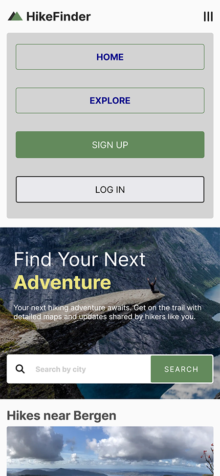
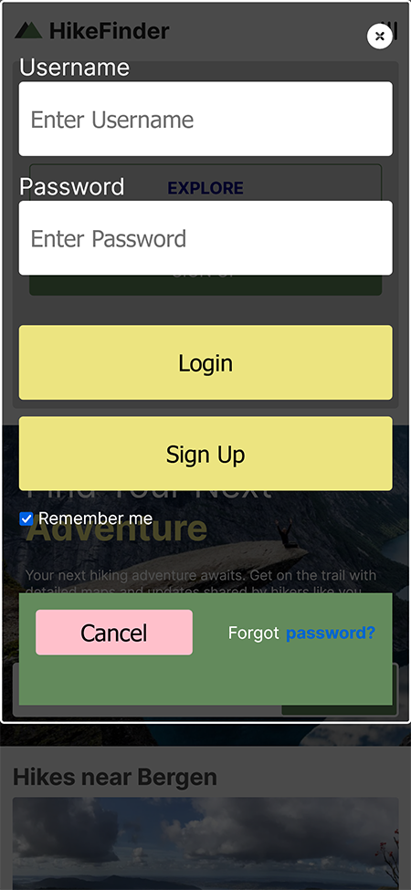

 ## Table of contents

- [Overview](#overview)
  - [The challenge](#the-challenge)
  - [Screenshot](#screenshot)
  - [Links](#links)
- [My process](#my-process)
  - [Built with](#built-with)
  - [What I learned](#what-i-learned)
  - [Continued development](#continued-development)
  - [Useful resources](#useful-resources)
- [Author](#author)
- [Acknowledgments](#acknowledgments)


### Overview

- Scrimba M6 bootcamp project- HikeFinder Website
- [Scrim](https://scrimba.com/scrim/cBR2mvuW)

<h2><a href="https://www.loom.com/share/aa9f0aa0be88452aa90c339253cd4e0b?sid=65d6499a-8824-41d8-b813-8a23884d8c81">Loom HikeFinder project walk-thru</a></h2>
<hr>


### The challenge

Requirements:
- build home and explore pages from "scratch"
- make each page responsive
  - mobile-first design
  - media queries
  - flexbox and/or grid
  - reponsive nav - small screens toggle hamburger menu

Stretch Goals
- design and build the "sign up" and "log in" form pages
- embed a Google map on the "explore" page
- add new pages - more info, links for resources

Personal stretch goal
- build accessible pop-up login and sign up modal

[Figma file](https://www.figma.com/file/YEOgujM7wAhrnG1MqVS6ud/Solo-Project%3A-HikeFinder-(Copy)?t=WzpPj259eh1evWth-0)

### Screenshot

<h2>Home Page - Desktop</h2>
<hr>


<h2>Explore Page - Desktop</h2>
<hr>


<h2>Login and Signup Modal - Desktop</h2>
<hr>


<h2>Home Page - Mobile</h2>
<hr>


<h2>Explore Page - Mobile</h2>
<hr>


<h2>Hamburger Menu - Mobile</h2>
<hr>



<h2>Login and Signup Modal - Mobile</h2>
<hr>



### Links

- [Scrim](https://scrimba.com/scrim/co6db4a14b1c7ed158787626b)
- [Github](https://github.com/casserole27/hikefinder)
- [Live Site](https://www.clewisdev.com/hikefinder/)

## My process

- Create Github repository
- Set up basic HTML file 
- Set up basic CSS file
- Set up basic JavaScript file
- Consult Figma design files
- Project work
- Publish live URL
- Check markup and accessibility
(https://validator.w3.org/)
(https://wave.webaim.org/)
- README file

### Built with

- semantic HTML5
- Accessibility
- CSS custom properties
- CSS grid
- CSS flexbox
- Mobile-first design
- Responsive Web Design

### What I learned

- Working with a larger CSS file and attempting to separate it using @import

- Building an accessible login and signup pop-up modal
  - responsive design
  - HTML dialog element
  - CSS ::backdrop pseudo-element
  - using JavaScript methods that can be associated with dialog element, .showModal() and .close()
  - using JavaScript to trap keyboard focus

<h2><a href="https://www.loom.com/share/10fffbd06bd5470fbd8235be4e708d72?sid=a50f844d-82f2-4c33-875f-ec3d375d6d67">Loom walk-thru: building an accessible pop-up modal</a></h2>
<hr>  

- Review of CSS grid syntax, and I tried some of the syntax I had not tried before.
- Site built mobile-first, grids enact @800 and 1000px media query
- Responsiveness takes care of the sizing so I'm not introducing a lot of breakpoints
- Hero section and home page:
```css
    .grid-container {
        margin-bottom: 4rem;
        
        display: grid;
        grid-template-rows: repeat(5, min-content);
        grid-template-columns: 1fr .5fr 1fr;
        gap: 1em;
    }

    .hero-container {
        grid-row: 1;
        grid-column: 1 / -1;

        display: grid;
        grid-template-columns: auto 1fr;
    }
```
- Site info section, both pages:

```css
@media (min-width: 800px) {
    
    .site-info-container {
        padding-top: 5em;
        padding-bottom: 5em;
        grid-auto-flow: column;
    }

    .info-description {
        max-width: 24rem;
        margin: 0 auto;
    }
}

```
- Grid-auto-flow works with how items are placed on the implicit grid

```css
.site-info-container {
    background-color: #ecebeb;
    padding: 2.25em 4em;
    text-align: center;
    display: grid;
    grid-auto-flow: row;
    gap: 2.5em;
}

@media (min-width: 800px) {
    
    .site-info-container {
        padding-top: 5em;
        padding-bottom: 5em;
        grid-auto-flow: column;
    }

    .info-description {
        max-width: 24rem;
        margin: 0 auto;
    }
}
```
- CSS backdrop filter
- This creates the black box behind the hero text so it doesn't have to be an additional element on the grid.

```css

.hero-text {
    max-width: 750px;
    backdrop-filter: brightness(50%);
    padding: 2.25em 1.5em;
}
```

- Explore page: grid within flex to handle map sizing
```css
    .explore-one,
    .explore-two,
    .explore-three {
        display: grid;
        grid-template-columns: 2fr 1fr;
        grid-template-rows: repeat(3, min-content);
    }

```

- Placement of pseudo-elements on the grid.
  - I didn't end up using this styling, but it is useful to know.


### Continued development

- Importing CSS files, the styling doesn't work sometimes. Why?

- Login form, additional functionality: "remember me" checkbox, etc

[Adding Google Maps to websites](https://developers.google.com/maps/documentation/javascript/adding-a-google-map#maps_add_map-javascript)


### Useful resources

[Scrimba help](https://different-marmoset-f7b.notion.site/HikeFinder-617beb91a1974dd19cbf74f086135a52)

[W3 Schools - how to create a login form](https://www.w3schools.com/howto/howto_css_login_form.asp)

[Kevin Powell - Pseudo-elements positioning on grid](https://www.youtube.com/watch?v=CcoPk7udIpA&list=PL4-IK0AVhVjPv5tfS82UF_iQgFp4Bl998&index=8)

- HTML dialog element
-[MDN](https://developer.mozilla.org/en-US/docs/Web/HTML/Element/dialog)
-[Web Dev Simplified](https://blog.webdevsimplified.com/2023-04/html-dialog/)


## Author

- Website - [C Lewis](https://www.clewisdev.com)
- LinkedIn - [LinkedIn](https://www.linkedin.com/in/clewisdev/)


## Acknowledgments

-Kevin Powell
-[Web Dev Simplified](https://blog.webdevsimplified.com)
-Brett James for the introduction to the HTML dialog element


